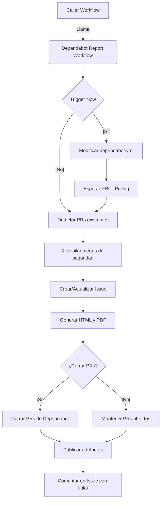
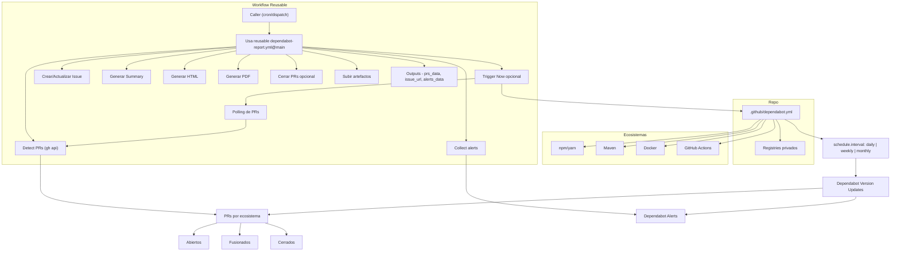

# 🛡️ Dependabot Report & Management Workflow

Este workflow reusable está diseñado para centralizar la gestión, monitoreo y reporte de las actualizaciones de dependencias detectadas por **Dependabot**. Su objetivo principal es transformar las notificaciones dispersas de Pull Requests en reportes ejecutivos consolidados (Issue, HTML, PDF) y mantener limpio el listado de PRs del repositorio.

Está orientado a equipos de **Desarrollo**, **Seguridad** y **DevOps** que necesitan visibilidad sobre la deuda técnica y vulnerabilidades sin el ruido de múltiples PRs abiertos simultáneamente.

---

## 📋 Tabla de Contenidos

- [🛡️ Dependabot Report \& Management Workflow](#️-dependabot-report--management-workflow)
  - [📋 Tabla de Contenidos](#-tabla-de-contenidos)
  - [🚀 Características Principales](#-características-principales)
  - [🔄 Flujo de Trabajo](#-flujo-de-trabajo)
    - [Diagrama Detallado (Mermaid)](#diagrama-detallado-mermaid)
  - [✅ Requisitos Previos](#-requisitos-previos)
  - [📖 Guía de Implementación](#-guía-de-implementación)
    - [Uso Básico](#uso-básico)
    - [Configuración Completa](#configuración-completa)
  - [⚙️ Referencia de Parámetros (Inputs)](#️-referencia-de-parámetros-inputs)
  - [🔐 Permisos Requeridos](#-permisos-requeridos)
  - [🔧 Configuraciones en el Repositorio](#-configuraciones-en-el-repositorio)
  - [🛠️ Detalles Técnicos y Limitaciones](#️-detalles-técnicos-y-limitaciones)
    - [Lo que NO hace este workflow](#lo-que-no-hace-este-workflow)
    - [Mecanismo de "Trigger Now"](#mecanismo-de-trigger-now)
    - [Programación de Dependabot](#programación-de-dependabot)
    - [Estructura de Reportes](#estructura-de-reportes)
    - [Solución de Problemas](#solución-de-problemas)
  - [📦 Salidas y Artefactos](#-salidas-y-artefactos)
  - [Referencias Oficiales](#referencias-oficiales)

---

## 🚀 Características Principales

| Característica | Descripción |
| :--- | :--- |
| **📊 Reportes Ejecutivos** | Genera reportes detallados en formato **PDF** y **HTML** con métricas, gráficas y tablas de resumen. |
| **📝 Issue de Resumen** | Crea o actualiza un Issue en GitHub con una tabla resumen de todos los PRs de Dependabot abiertos. |
| **🧹 Limpieza Automática** | Opción para cerrar automáticamente los PRs de Dependabot (`close_dependabot_prs`) para evitar ruido, centralizando la gestión en el reporte. |
| **⚡ Trigger bajo Demanda** | Capacidad de forzar la ejecución de Dependabot (`trigger_dependabot_now`) modificando el fichero de configuración. |
| **🚨 Alertas de Seguridad** | Recopila y resume las alertas de seguridad (Dependabot Alerts) activas en el repositorio. |
| **🎨 Personalizable** | Permite configurar logos, nombre de la empresa y títulos de los reportes. |

---

## 🔄 Flujo de Trabajo



### Diagrama Detallado (Mermaid)

Representación ampliada del flujo entre ecosistemas, dependabot.yml, ejecuciones y el workflow reusable.



---

## ✅ Requisitos Previos

Para que este workflow funcione correctamente, debes asegurarte de cumplir con lo siguiente:

1.  **Configuración de Dependabot**: El repositorio debe tener ya configurado el fichero `.github/dependabot.yml`. Este workflow **no crea** la configuración de Dependabot, solo la gestiona y reporta.
2.  **Permisos del Token**: El `GITHUB_TOKEN` utilizado debe tener permisos suficientes (ver sección de Permisos).
3.  **Secretos (Opcional)**: Si utilizas registros privados, asegúrate de que Dependabot tenga acceso a ellos, aunque este workflow opera a nivel de gestión de PRs y no de instalación de paquetes.

---

## 📖 Guía de Implementación

### Uso Básico

Para integrar este reporte en tu repositorio, crea un archivo en `.github/workflows/dependabot-check.yml`:

```yaml
name: 🛡️ Security - Dependabot Report

on:
  # Ejecutar semanalmente o cuando se desee
  schedule:
    - cron: '0 6 * * 1' # Lunes a las 6:00 AM
  workflow_dispatch:

jobs:
  dependabot-report:
    uses: jersonmartinez/reusable-workflows/.github/workflows/dependabot-report.yml@main
    with:
      create_issue: true
      close_dependabot_prs: true
    permissions:
      contents: write
      pull-requests: write
      issues: write
      security-events: read
```

### Configuración Completa

Ejemplo con todas las capacidades habilitadas, incluyendo trigger inmediato y personalización de marca:

```yaml
name: 🛡️ Security - Dependabot Report Full

on:
  workflow_dispatch:
    inputs:
      trigger_now:
        description: 'Forzar ejecución de Dependabot ahora'
        type: boolean
        default: false

jobs:
  dependabot-report:
    uses: jersonmartinez/reusable-workflows/.github/workflows/dependabot-report.yml@main
    with:
      # Comportamiento
      trigger_dependabot_now: ${{ inputs.trigger_now }}
      wait_minutes: 15          # Esperar hasta 15 min si se disparó la ejecución
      close_dependabot_prs: true # Cerrar PRs para limpiar el board
      
      # Reportes
      create_issue: true
      issue_title: '🛡️ Reporte Semanal de Dependencias: ${date}'
      generate_pdf_report: true
      generate_html_report: true
      
      # Personalización
      company_name: 'Mi Empresa S.A.'
      logo_url: 'https://mi-empresa.com/logo.png'
      
    permissions:
      contents: write       # Necesario para trigger_dependabot_now (git push)
      pull-requests: write  # Necesario para cerrar PRs
      issues: write         # Necesario para crear el Issue
      security-events: read # Necesario para leer alertas
```

---

## ⚙️ Referencia de Parámetros (Inputs)

| Input | Tipo | Default | Descripción |
| :--- | :--- | :--- | :--- |
| `create_issue` | `boolean` | `true` | Crea un Issue en GitHub con el resumen de los hallazgos. |
| `issue_title` | `string` | `Reporte Dependabot: ${date}` | Título del Issue. Soporta `${date}` como variable. |
| `close_dependabot_prs` | `boolean` | `true` | Si es `true`, cierra los PRs de Dependabot detectados para reducir ruido. |
| `trigger_dependabot_now` | `boolean` | `false` | Si es `true`, modifica `dependabot.yml` para forzar una ejecución inmediata. |
| `wait_minutes` | `number` | `5` | Tiempo de espera (polling) para detectar nuevos PRs si se activó el trigger. |
| `dependabot_config_path` | `string` | `.github/dependabot.yml` | Ruta al fichero de configuración de Dependabot. |
| `generate_pdf_report` | `boolean` | `false` | Genera un archivo PDF descargable con el reporte completo. |
| `generate_html_report` | `boolean` | `true` | Genera un archivo HTML interactivo con el reporte. |
| `company_name` | `string` | `Report` | Nombre de la empresa para el encabezado de los reportes. |
| `logo_url` | `string` | `...` | URL del logo a incluir en los reportes HTML/PDF. |
| `dry_run_close` | `boolean` | `false` | Simula el cierre de PRs sin ejecutar la acción real (para pruebas). |
| `skip_close_labels` | `string` | `''` | Lista de etiquetas (separadas por coma) que evitarán que un PR sea cerrado automáticamente. |
| `create_missing_labels` | `boolean` | `false` | Intenta crear etiquetas faltantes; la validación está deshabilitada actualmente. |
| `issue_labels` | `string` | `dependabot-report` | Etiquetas que se aplicarán al Issue generado. |
| `create_issue_if_empty` | `boolean` | `true` | Crea el Issue aunque no existan PRs detectados. |
| `upload_debug_artifact` | `boolean` | `true` | Publica artefactos de depuración (logs y JSONs) del run. |
| `dependabot_logins` | `string` | `dependabot,dependabot[bot],app/dependabot` | Logins considerados al filtrar PRs de Dependabot. |
| `poll_interval_seconds` | `number` | `30` | Intervalo de polling cuando se habilita `trigger_dependabot_now`. |
| `prs_state` | `string` | `all` | Estado de PRs a recuperar: `open`, `closed` o `all`. |
| `max_prs_in_summary` | `number` | `30` | Máximo de PRs que se muestran en el summary del job. |
| `fast_summary` | `boolean` | `true` | Usa datos detectados sin consultar cada PR individualmente. |
| `html_report_name` | `string` | `dependabot-report.html` | Nombre del archivo de reporte HTML. |
| `pdf_report_name` | `string` | `dependabot-report.pdf` | Nombre del archivo de reporte PDF. |

> Nota: Si el workflow caller no define un input, se utilizará el `default` establecido en el reusable `dependabot-report.yml`.

---

## 🔐 Permisos Requeridos

Este workflow realiza acciones privilegiadas. Asegúrate de otorgar los siguientes permisos en el job que llama al workflow (`caller`):

```yaml
permissions:
  contents: write       # Requerido si usas trigger_dependabot_now (hace commit)
  pull-requests: write  # Requerido para listar y cerrar PRs
  issues: write         # Requerido para crear/editar el Issue de reporte
  security-events: read # Requerido para leer alertas de seguridad (Dependabot Alerts)
```

> [!WARNING]
> Si no proporcionas `contents: write` y activas `trigger_dependabot_now`, el workflow fallará al intentar modificar el archivo de configuración.

## 🔧 Configuraciones en el Repositorio

Para activar Dependabot y que los reportes funcionen correctamente, aplica estas configuraciones en tu repositorio:

- Habilitar el grafo de dependencias y alertas de seguridad:
  - Ir a `Settings → Code security` y activar `Dependency graph` y `Dependabot alerts`.
  - Referencia: https://docs.github.com/en/code-security/dependabot/dependabot-alerts/configuring-dependabot-alerts
- Habilitar Dependabot version updates:
  - Opción A: desde `Settings → Code security`, habilitar “Dependabot version updates” para que se genere un `dependabot.yml` básico.
  - Opción B: crear manualmente `.github/dependabot.yml` en la rama por defecto.
  - Referencias: https://docs.github.com/en/code-security/dependabot/dependabot-version-updates/configuring-dependabot-version-updates
- Configurar `.github/dependabot.yml` mínimo:

```yaml
version: 2
updates:
  - package-ecosystem: github-actions
    directory: "/"
    schedule:
      interval: weekly
  - package-ecosystem: npm
    directory: "/"
    schedule:
      interval: monthly
```

- Acceso a registries privados (si aplica):
  - Define `registries:` en `dependabot.yml` con credenciales para Docker/NPM/Maven, etc.
  - Referencia: https://docs.github.com/en/code-security/dependabot/dependabot-version-updates/configuration-options-for-the-dependabot.yml-file
- Consideración de seguridad en PRs de Dependabot:
  - Los workflows disparados por PRs de Dependabot usan un `GITHUB_TOKEN` de solo lectura y no acceden a secretos.
  - Referencia: https://docs.github.com/en/code-security/dependabot/working-with-dependabot/keeping-your-actions-up-to-date-with-dependabot

---

## 🛠️ Detalles Técnicos y Limitaciones

### Lo que NO hace este workflow
*   ❌ **No configura Dependabot desde cero**: Aunque existen pasos en el código fuente relacionados con la generación de configuración (`Generate Dependabot Config`), estos están actualmente deshabilitados (`if: false`). Se asume que ya tienes un `dependabot.yml` válido.
*   ❌ **No valida etiquetas (Labels)**: La lógica de validación y creación de etiquetas de ecosistemas también está deshabilitada en la versión actual.
*   ❌ **No resuelve conflictos**: Si un PR de Dependabot tiene conflictos, este workflow solo lo reporta, no intenta arreglarlo.

### Mecanismo de "Trigger Now"
La funcionalidad `trigger_dependabot_now` funciona mediante un "hack" benigno: añade un comentario con la fecha actual al final del archivo `dependabot.yml` y hace un commit. Esto es detectado por GitHub como un cambio en la configuración, lo que dispara inmediatamente la búsqueda de actualizaciones por parte de Dependabot.

### Programación de Dependabot

No es posible configurar directamente en `dependabot.yml` que Dependabot se ejecute "cada 3 meses" o con un intervalo trimestral. Los únicos valores permitidos para `schedule.interval` son:

- `daily` (diario)
- `weekly` (semanal)
- `monthly` (mensual)

Ejemplo de configuración soportada en `dependabot.yml` para ejecutar mensualmente a una hora específica:

```yaml
updates:
  - package-ecosystem: npm
    directory: /
    schedule:
      interval: monthly
      time: "06:00"
      timezone: "America/Mexico_City"
```

Para lograr un comportamiento de "cada 3 meses", utiliza un workflow de **GitHub Actions** que dispare Dependabot en ese intervalo (por ejemplo, habilitando `trigger_dependabot_now`). Ejemplo de programación trimestral con cron:

```yaml
name: Quarterly Dependabot Trigger
on:
  schedule:
    - cron: "0 6 1 */3 *" # 1er día cada 3 meses a las 06:00 UTC
jobs:
  dependabot-report:
    uses: jersonmartinez/reusable-workflows/.github/workflows/dependabot-report.yml@main
    with:
      trigger_dependabot_now: true
    permissions:
      contents: write
      pull-requests: write
```

Nota: `time` y `timezone` en `dependabot.yml` controlan la hora y el huso horario, pero el intervalo siempre debe ser uno de los tres valores soportados anteriores.

### Estructura de Reportes
*   **SemVer**: Los reportes clasifican las actualizaciones en `major`, `minor` y `patch` basándose en el análisis semántico de las versiones.
*   **Prioridad**: Se destacan las actualizaciones de seguridad críticas.

### Solución de Problemas
- Summary vacío o conteos en 0: asegúrate de conceder `permissions.pull-requests: read` (o `write`) al job que llama y que el token esté disponible; la clasificación de `open/merged/closed` requiere acceso a la API de PRs.
- PRs no detectados: verifica `prs_state` (`all`, `open`, `closed`) y que `dependabot_logins` incluya los autores habituales de Dependabot en tu repositorio.
- Trigger inmediato no funciona: confirma `permissions.contents: write` y que el archivo indicado en `dependabot_config_path` existe y es accesible.
- Horarios y zonas: en `dependabot.yml`, `time` y `timezone` se aplican al intervalo seleccionado; para una programación trimestral usa un workflow con `on.schedule` y cron.

---

## 📦 Salidas y Artefactos

Al finalizar, el workflow produce:

1.  **Issue en GitHub**: Un resumen visible para todo el equipo.
2.  **Artefactos de Workflow**:
    *   `dependabot-report.pdf`: Documento formal para auditoría o management.
    *   `dependabot-report.html`: Vista web amigable.
    *   `debug-artifacts`: Logs y JSONs crudos (si `upload_debug_artifact` es true).
3.  **Outputs del Job** (para encadenar lógica en el caller):
    *   `prs_data`: JSON con los PRs de Dependabot detectados.
    *   `issue_url`: URL del Issue creado/actualizado.
    *   `alerts_data`: JSON con las alertas de seguridad activas.

## Referencias Oficiales

- Dependabot options reference: https://docs.github.com/en/code-security/dependabot/working-with-dependabot/dependabot-options-reference
- Configuring Dependabot version updates: https://docs.github.com/en/code-security/dependabot/dependabot-version-updates/configuring-dependabot-version-updates
- Keeping your actions up to date with Dependabot: https://docs.github.com/en/code-security/dependabot/working-with-dependabot/keeping-your-actions-up-to-date-with-dependabot
- About Dependabot alerts: https://docs.github.com/en/code-security/dependabot/dependabot-alerts/about-dependabot-alerts
- Configuring Dependabot alerts: https://docs.github.com/en/code-security/dependabot/dependabot-alerts/configuring-dependabot-alerts
- Enterprise Server 3.10 – options reference (intervales `daily/weekly/monthly`): https://docs.github.com/en/enterprise-server@3.10/code-security/dependabot/dependabot-version-updates/configuration-options-for-the-dependabot.yml-file

> [!TIP]
> Utiliza el reporte HTML para una navegación rápida y el PDF para archivar evidencias de cumplimiento de seguridad.
